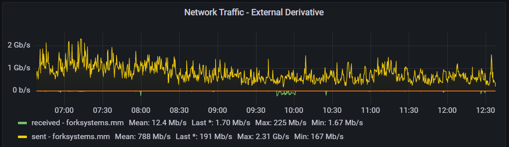

# Network Traffic Characteristics

This document describes the expected traffic flows and their scale on a typical 10Gbps Micro Mirror.

Each Micro Mirror is a single smaller server with local storage, which is filled from an upstream rsync server, and used to serve client download requests as a member of each project's content distribution network.
The requests are steered to mirrors from each project's CDN load balancers, so a typical client will send the request for a desired file to the project's main servers, they will check that a specific mirror is currently healthy, and then serve a HTTP 302 redirect to have the client download the file directly from the chosen mirror.

The volume of traffic served by each mirror for each project hosted by it varies greatly depending on several factors:

* The general size and install base of the project. Larger and more popular projects will have more clients asking to download files relevant to that project.
* The number of other participating mirrors supporting this project, and the health of those mirrors. When a major mirror or a number of mirrors happen to be offline or out of date at the same time, that load is redistributed to the remaining mirrors in each project's CDN.
* If the project has recently shipped any updates or released a new version of their software. On a typical day OS clients will request the top level serial number for the project, confirm that there's no new updates available, and move on. When there's security or feature updates, particularly for large packages such as the Linux kernel, LibreOffice, the Java toolchain, etc, then all of the clients downloading that new package can cause a sizable uptick in traffic on a specific day.
* The geographical location of the mirror. Many projects will try and steer clients to a geographically near-by mirror, so a mirror located in a high traffic area such as Virginia on the east coast will see significantly more requests for a project than one in the midwest.

## Traffic Flows

The traffic flows in and out of a Micro Mirror consist of the following:

1. Management and control traffic. The management and control of Micro Mirrors happens over SSH based on key-pair authentication from the admin's computers. (volume: tiny)

2. Streaming Telemetry and Monitoring. Each Micro Mirror streams telemetry on system health and the client requests it's handing back to a watchtower system over syslog and collectd. (Volume: ~100kbps)

3. Rsync updates from upstream mirrors. As each project releases new files to be hosted by the mirror constellation, each mirror downloads a copy of the new files to update their local repository. (Volume: 20-100GB/day. 200Mbps per project)

4. Client requests over HTTP/HTTPS/RSYNC. Public clients requesting file downloads and project health checker systems will request various files over HTTP or Rsync, with the exact volume per mirror and per project per day varying greatly based on the variables mentioned previously. (Volume: 3-15TB/day. 100Mbps-3Gbps)

The egress traffic from a mirror typically sits in the 500Mbps-2Gbps range the majority of the time.
It is extremely rare for the level of traffic to exceed 3Gbps based on 5 second averages, and has only been seen during exceptional events such as release days for popular Linux distributions or major security patches for popular software for a few hours.

Typical 24 hour network traffic from a Micro Mirror's perspective

## Quality of Service Considerations

Due to the nature of update traffic being a background, low priority, bulk file transfer, the HTTP and RSYNC traffic being passed by Micro Mirrors may all be considered scavenger class.

To assist in that, all relevant egress traffic from the Micro Mirror appliances are marked with the CS1 DSCP mark (0x08), which is conventionally used to indicate scavenger class.

Since the majority of traffic is egress, hosts are encouraged to set up QoS policies to protect their egress bandwidth from these appliances, but we do ask that no policers are implemented to artificially limit the network speed for the Micro Mirror.
In event of congestion, drop as much Micro Mirror traffic as desired, but when unutilized we would like 100% capacity available to the mirror.
